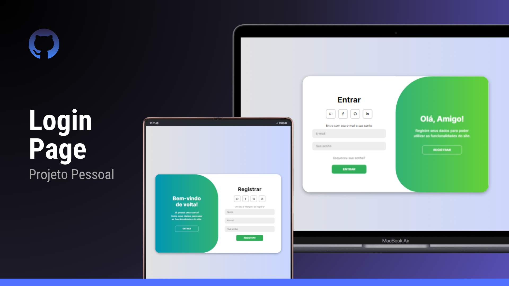

<h1 align="center"> Página de Login </h1>

  <a href="#-tecnologias">Tecnologias</a>&nbsp;&nbsp;&nbsp;|&nbsp;&nbsp;&nbsp;
  <a href="#-projeto">Projeto</a>&nbsp;&nbsp;&nbsp;|&nbsp;&nbsp;&nbsp;
  <a href="#memo-licença">Licença</a>
  

  

 

  

## 🚀 Tecnologias

Esse projeto foi desenvolvido com as seguintes tecnologias:

- HTML, CSS e JavaScript
- Git e Github

## 💻 Projeto

O projeto "Página de Login" é uma home page para para a realização de um login ou registro de usuário. Para ver a animação feita com JavaScrip entre no link abaixo:

- [Acesse o projeto finalizado (online). ](https://silverioesantos.github.io/LoginPage/)

## :memo: Licença

Esse projeto está sob a licença MIT.
